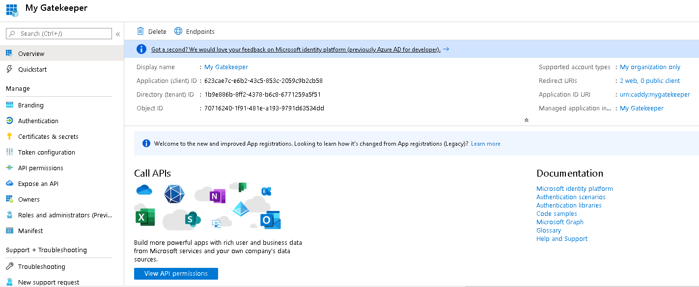
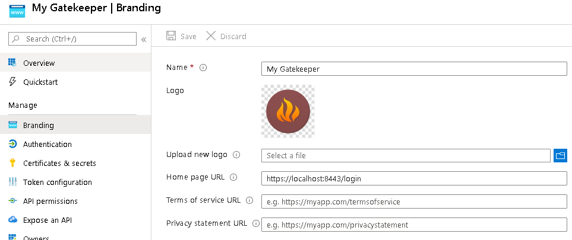
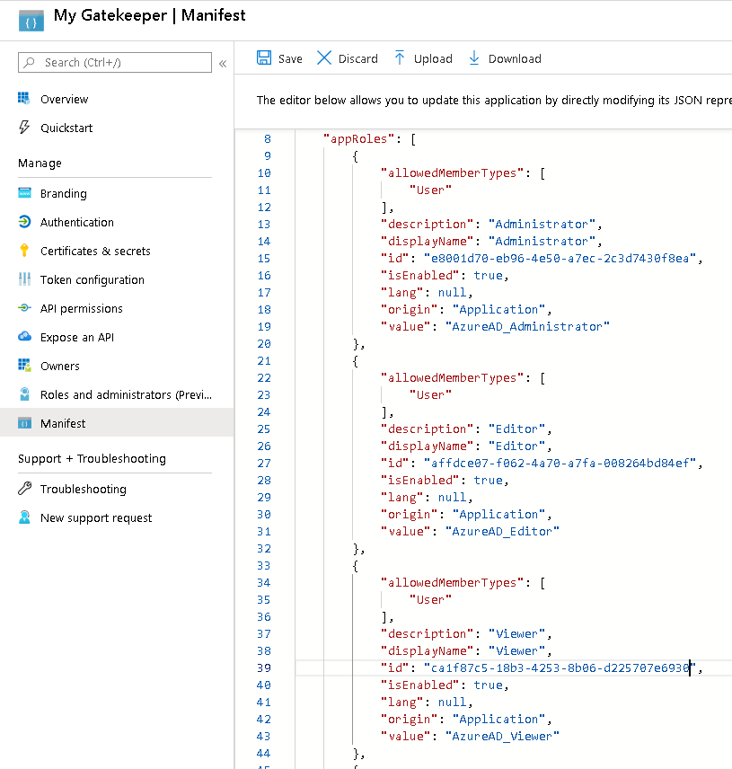
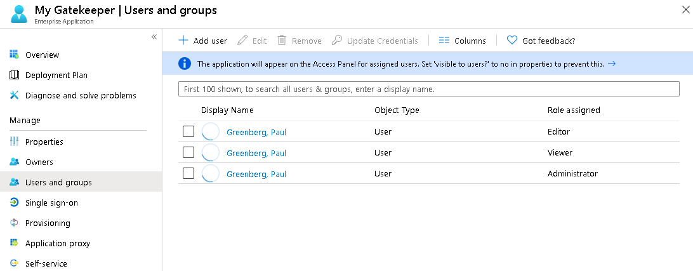
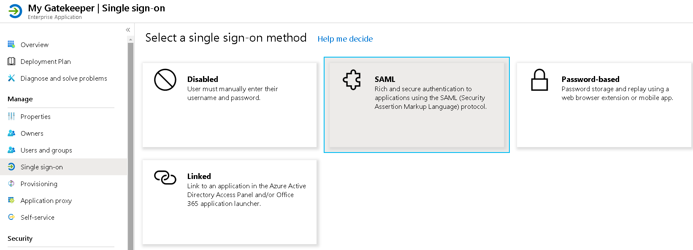
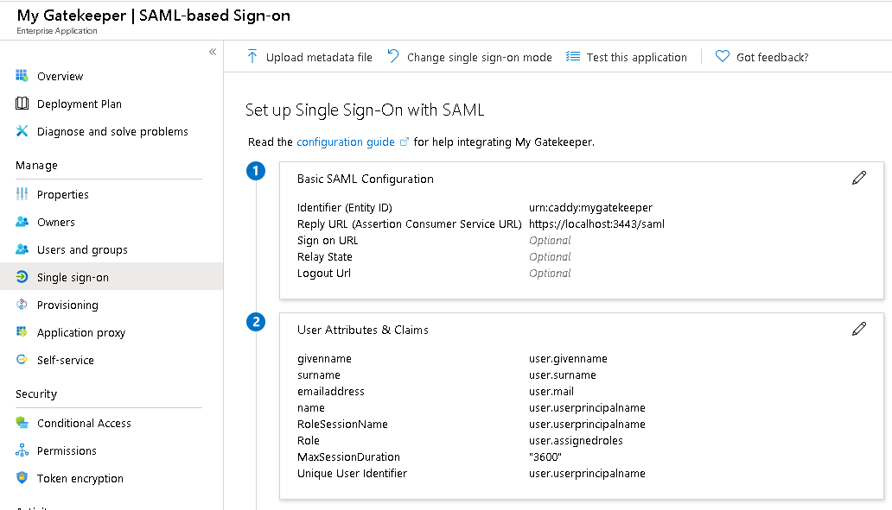
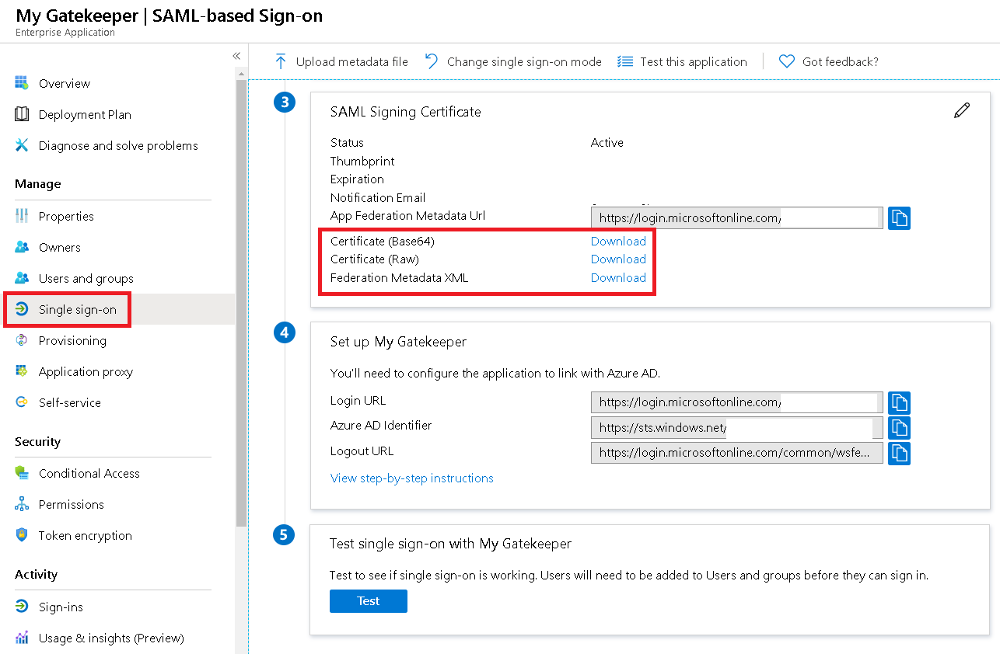

# caddy-auth-saml

SAML Authentication Plugin for Caddy v2.

The plugin supports the following identity providers:

* [Azure Active Directory (Office 365) Applications](#azure-active-directory-office-365-applications)
* [AWS Cognito](#aws-cognito)

## Getting Started


## Azure Active Directory (Office 365) Applications

### Caddy Configuration

The plugin supports the following parameters for Azure Active
Directory (Office 365) applications:

| **Parameter Name** | **Description** |
| --- | --- |
| `enabled` | Enable Azure AD Identity Provider |
| `idp_metadata_location` | The url or path to Azure IdP Metadata |
| `idp_sign_cert_location` | The path to Azure IdP Signing Certificate |
| `tenant_id` | Azure Tenant ID |
| `application_id` | Azure Application ID |
| `application_name` | Azure Application Name |
| `entity_id` | Azure Application Identifier (Entity ID) |
| `acs_urls` | Azure Application Reply URLs (Assertion Consumer Service URL) |

Please review `assets/conf/azure/Caddyfile.json` configuration file

```bash
cat assets/conf/azure/Caddyfile.json | jq '.apps.http.servers.srv0.routes'
```

The following Caddy configuration enabled SAML-based authentication
at `/saml` endpoint. If a user browses to `/saml`, the user would see
a "Sign In" page.

```json
[
  {
    "handle": [
      {
        "handler": "authentication",
        "providers": {
          "saml": {
            "auth_url_path": "/saml",
            "jwt": {
              "token_name": "JWT_TOKEN",
              "token_secret": "383aca9a-1c39-4d7a-b4d8-67ba4718dd3f",
              "token_issuer": "7a50e023-2c6e-4a5e-913e-23ecd0e2b940"
            },
            "azure": {
              "idp_metadata_location": "/etc/caddy/auth/saml/idp/azure_ad_app_metadata.xml",
              "idp_sign_cert_location": "/etc/caddy/auth/saml/idp/azure_ad_app_signing_cert.pem",
              "tenant_id": "1b9e886b-8ff2-4378-b6c8-6771259a5f51",
              "application_id": "623cae7c-e6b2-43c5-853c-2059c9b2cb58",
              "application_name": "My Gatekeeper",
              "entity_id": "https://localhost:3443/saml/azure",
              "acs_urls": [
                "https://localhost:3443/saml/azure"
              ]
            },
            "ui": {
              "template_location": "assets/ui/ui.template",
              "allow_role_selection": false
            }
          }
        }
      }
    ],
    "match": [
      {
        "path": [
          "/saml*"
        ]
      }
    ],
    "terminal": true
  },
  {
    "handle": [
      {
        "body": "OK",
        "handler": "static_response",
        "status_code": 200
      }
    ],
    "match": [
      {
        "path": [
          "/health"
        ]
      }
    ],
    "terminal": true
  },
  {
    "handle": [
      {
        "body": "1.0.0",
        "handler": "static_response",
        "status_code": 200
      }
    ],
    "match": [
      {
        "path": [
          "/version"
        ]
      }
    ],
    "terminal": true
  }
]
```


### Set Up Azure AD Application

In Azure AD, you will have an application, e.g. "My Gatekeeper".

The application is a Caddy web server running on port 3443 on
`localhost`. This example meant to emphasize that the authorization
is asynchronious. That is when a user clicks on "My Gatekeeper" icon
in Office 365, the browser takes the user to a sign in page
at URL `https://localhost:3443/saml`.



The Application Identifiers are as follows:

* Application (client) ID: `623cae7c-e6b2-43c5-853c-2059c9b2cb58`
* Directory (tenant) ID: `1b9e886b-8ff2-4378-b6c8-6771259a5f51`
* Object ID: `515d2e8b-7548-413f-abee-a23ece1ea576`

The "Branding" page configures "Home Page URL".



For demostration purposes, we will create the following "Roles" in the application:

* Viewer
* Editor
* Administrator

Use "Manifest" tab to add roles in the manifest via `appRoles` key:



```json
{
  "allowedMemberTypes": [
    "User"
  ],
  "description": "Administrator",
  "displayName": "Administrator",
  "id": "91287df2-7028-4d5f-b5ae-5d489ba217dd",
  "isEnabled": true,
  "lang": null,
  "origin": "Application",
  "value": "AzureAD_Administrator"
},
{
  "allowedMemberTypes": [
    "User"
  ],
  "description": "Editor",
  "displayName": "Editor",
  "id": "d482d827-1757-4f60-9bea-021c10037674",
  "isEnabled": true,
  "lang": null,
  "origin": "Application",
  "value": "AzureAD_Editor"
},
{
  "allowedMemberTypes": [
    "User"
  ],
  "description": "Viewer",
  "displayName": "Viewer",
  "id": "c69f7abd-0a88-401e-b515-92d74b6fff2f",
  "isEnabled": true,
  "lang": null,
  "origin": "Application",
  "value": "AzureAD_Viewer"
}
```

After, we added the roles, we could assign any of the roles to a user:



The app is now available to the provisioned users in Office 365:


### Configure SAML Authentication

Go to "Enterprise Application" and browse to "My Gatekeeper" application.

There, click "Single Sign-On" and select "SAML" as the authentication method.



Next, in the "Set up Single Sign-On with SAML", provide the following
"Basic SAML Configuration":

* Identifier (Entity ID): `https://localhost:3443/saml`
* Reply URL (Assertion Consumer Service URL): `https://localhost:3443/saml`



Under "User Attributes & Claims", add the following claims to the list of
default claims:

| **Namespace** | **Claim name** | **Value** |
| --- | --- | --- |
| `http://claims.contoso.com/SAML/Attributes` | `RoleSessionName` | `user.userprincipalname` |
| `http://claims.contoso.com/SAML/Attributes` | `Role` | `user.assignedroles` |
| `http://claims.contoso.com/SAML/Attributes` | `MaxSessionDuration` | `3600` |


Next, record the following:
* App Federation Metadata Url
* Login URL

Further, download:
* Federation Metadata XML
* Certificate (Base64 and Raw)




### Azure AD IdP Metadata and Certificate

The following command downloads IdP metadata file for Azure AD Tenant with
ID `1b9e886b-8ff2-4378-b6c8-6771259a5f51`. Please note the `xmllint` utility
is a part of `libxml2` library.

```bash
curl -s -L -o /tmp/federationmetadata.xml https://login.microsoftonline.com/1b9e886b-8ff2-4378-b6c8-6771259a5f51/federationmetadata/2007-06/federationmetadata.xml
sudo mkdir -p /etc/saml
cat /tmp/federationmetadata.xml | xmllint --format - | sudo tee /etc/saml/azure_ad_idp_metadata.xml
```

The `/etc/saml/azure_ad_idp_metadata.xml` contains IdP metadata. This file contains
the data necessary to verify the SAML claims received by this service and signed
by Azure AD. The `idp_metadata` argument is being used to pass the location of
IdP metadata.

Next, download the "Certificate (Base64)" and store it in `/etc/saml/azure_ad_signing_cert.pem`.

### User Interface Options

First option is a login button on the login server web page. Once Azure AD has
been enabled, the `/saml` page will have "Sign in with Office 365" button


Second option is Office 365 applications. When a user click on the
application's icon in Office 365, the user gets redirected to the web
server by Office 365.


The URL is `https://localhost:3443/saml`.

The below is the headers of the `POST` request that the user's browser makes:

```
Method: POST
URL: /saml
Protocol: HTTP/2.0
Host: localhost:3443
Accept: text/html,application/xhtml+xml,application/xml;q=0.9,image/webp,image/apng,*/*;q=0.8,application/signed-exchange;v=b3;q=0.9
Accept-Encoding: gzip, deflate, br
Accept-Language: en-US,en;q=0.9,ru;q=0.8
Cache-Control: max-age=0
Content-Length: 7561
Content-Type: application/x-www-form-urlencoded
Origin: https://login.microsoftonline.com
Referer: https://login.microsoftonline.com/
Sec-Fetch-Mode: navigate
Sec-Fetch-Site: cross-site
Upgrade-Insecure-Requests: 1
```

The above redirect contains `login.microsoftonline.com` in the request's
`Referer` header. It is the trigger to perform SAML-based authorization.

## AWS Cognito

TODO.
